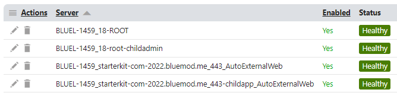
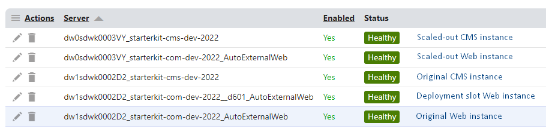
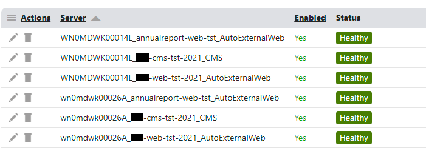

# Kentico Xperience Enhanced Web Farm Name Provider

## Overview
The Kentico Xperience Enhanced Web Farm Name Provider ensures every Xperience 13 application instance has a unique web farm name to prevent hard-to-troubleshoot hosting problems. The initial symptoms are often caching problems and file synchronization problems – that is, caches that are only cleared in some application instances, or file uploads that are not propagated to all instances.

If you have multiple Xperience sites hosted on the same server or Azure App Service Plan, or use Azure App Service deployment slots, installing this module will solve several common, hard-to-troubleshoot problems.

## Background
Kentico Xperience web farm synchronization is a built-in feature that keeps all application instances updated when content changes in the environment. It synchronizes changes to site settings, content, cache dependencies, and file uploads that occur in one app instance, to all other app instances.

When web farm synchronization was first introduced, there was almost always one app instance per server. This made it easy to ensure each app instance had a unique web farm name. By default, it would use the machine name. However, with the introduction of the MVC development model, it became more likely to have multiple application instances on the same server. This meant it was necessary to be mindful that web farm synchronization is not just keeping servers in sync, it is keeping application instances in sync. Therefore, it was critical to ensure each application instance had a unique web farm name.

Kentico solved the basic scenario introduced by the MVC development model, by adding the _AutoExternalWeb suffix to the web farm name of MVC application instances. This ensured the CMS app instance and the MVC app instance on the same server have unique names. 

## Problem
Even though automatic web farm naming worked for the basic MVC development model, it still left these common scenarios, where multiple application instances would have the same web farm name unless the web farm names were manually configured:

-	Hosting multiple Xperience sites (e.g., a separate MVC app for each domain) on the same server or in the same Azure App Service Plan.
-	Using Azure App Service deployment slots. A deployment slot creates a second Azure App Service in the same Azure App Service Plan.

In these scenarios, there would be no indication that multiple app instances were sharing the same web farm name. This would cause hard-to-troubleshoot problems such as outdated or missing content (cache problems) and missing media files.

The reason these problems would happen is because Xperience automatically logs every change to the database as a web farm task. However, it will log a separate copy of the task for each web farm member. If two app instances share the same web farm name, there will only be one copy of the task for both. The first server to poll the database for synchronization tasks will get it, and the other app instance will not find a task to process. This will often lead developers to look for problems with a specific app instance, and then be baffled when the problem shifts to an apparently healthy app instance intermittently.

## Solution
The Enhanced Web Farm Name Provider solves this problem by automatically ensuring every app instance has a unique web farm name. This module can be added to any Xperience 13 application, including the CMS app, a .NET Framework 4.8 web app, and a .NET 6+ web app.

It creates a unique web farm name in different ways depending on the hosting environment and the target framework:

-	In Azure, regardless of the target framework, the unique name will be created using the machine name and the WEBSITE_DEPLOYMENT_ID environment variable.
-	In .NET Framework 4.8 on IIS, the unique name will be created using the machine name and IIS website ApplicationID.
-	In .NET 6+ on IIS or Kestrel, the unique name will be created using the machine name and the bound server address, including host name and port.

## Installation

1.	Add the NuGet package, [XperienceCommunity.EnhancedWebFarmNameProvider](https://www.nuget.org/packages/XperienceCommunity.EnhancedWebFarmNameProvider/) to your Kentico Xperience 13 projects, including both the CMS and MVC projects.
2.	In your CMS project, add the [Kentico.Xperience.Libraries](https://www.nuget.org/packages/Kentico.Xperience.Libraries/)  package that matches your Xperience hotfix version. This is critical to prevent the 13.0.13 version of the Xperience libraries from being used when compiling your project.
3.	Build both projects.

## Performance recommendation

Especially in Azure, a web farm name may change unexpectedly. If Azure detects that an app instance is unhealthy, it will replace it with a new one and cause a new web farm name to be created. If the app service is scaled out, either manually or with autoscaling, new web farm names will also be created. This makes it likely for old names to transition to the *not responding* status in the Xperience web farm app. When this happens, Xperience will continue to collect web farm tasks for 24 hours, before it deletes the *not responding* web farm member from the system. This will cause unnecessarly load on the system, by allowing the CMS_WebFarmTask table to become huge.

Using the [CMSWebFarmNotRespondingInterval](https://docs.kentico.com/13/configuring-xperience/reference-web-config-application-keys#web-farm-synchronization-settings) application key, you can set the interval to a lower value. For example, setting it to 60 will cause a web farm member that is in the *not responding* state to be deleted after 1 hour instead of after 24 hours. This key should be set in the web.config or appsettings.json file in each Xperience application instance.

Examples:

**web.config**

```
<add key="CMSWebFarmNotRespondingInterval" value="60" />
```

**appsettings.json**
```
"CMSWebFarmNotRespondingInterval": 60,
```

## License requirements
This module ensures each app instance has a unique web farm server name. Therefore, if you are using an old per-server licensing model, you may discover for the first time scenarios that were putting you over the server-count license limit (e.g., using Azure deployment slots). In that case, you will see the "License webfarm server count exceeded" error in the Xperience event log.

Fortunately, Kentico's subscription licensing model brings [auto-scaling for all](https://www.kentico.com/discover/blog/new-xperience-pricing-gets-innovatively-disruptive). For almost all cases, server counting is a thing of the past.

## Example scenarios

Here's a few screenshots showing what the web farm server names will look like in the many tested scenarios:

**Web farm names in local environment, using IIS, Kestrel, and IIS virtual root**



**Web farm names in Azure, using scale out and deployment slots**




**Web farm names in Azure, using scale out and multiple app services with separate custom domains**



And, here's a summary of the scenarios tested and examples of the automatic web farm names:

|Scenario|Example web farm name|
|---|---|
|IIS-hosted, CMS app|BLUEL-1459_18-root|
|IIS Express-hosted, CMS app|BLUEL-1459_2-root|
|Kestrel hosted|BLUEL-1459_localhost_53466_AutoExternalWeb|
|IIS in-process, .NET 6+|BLUEL-1459_starterkit-com-2022.bluemod.me_443_AutoExternalWeb|
|IIS out-of-process, .NET 6+|BLUEL-1459_127.0.0.1_20536_AutoExternalWeb|
|IIS Express, in-process, .NET 6+|BLUEL-1459_localhost_51887_AutoExternalWeb|
|IIS in-process, .NET 6+, in virtual root|BLUEL-1459_starterkit-com-2022.bluemod.me_443-childapp_AutoExternalWeb|
|IIS-hosted, CMS app, virtual root|BLUEL-1459_18-root-childadmin|
|CMS app in Azure app service|dw0sdwk0003VY_starterkit-cms-dev-2022|
|.NET 6+, Azure app service|dw0sdwk0003VY_starterkit-com-dev-2022_AutoExternalWeb|
|.NET 6+, Azure app service slot|dw0sdwk0003VY_starterkit-com-dev-2022__ca5f_AutoExternalWeb|
|.NET 6+, 2nd app service in Azure App Service Plan|dw1sdwk0002D2_starterkit-com-dev-2022_AutoExternalWeb|
|.NET 6+, 2nd app service, deployment slot|dw1sdwk0002D2_starterkit-com-dev-2022__d601_AutoExternalWeb|


## Compatibility

-	.NET 4.8 or higher for the CMS app and MVC5 projects.
-	.NET 6 or .NET 8 for ASP.NET Core MVC projects
-	.NET 4.8 or higher for the admin app or MVC5 projects

## Credit

Sincere thanks to [Brandon Henricks](https://github.com/brandonhenricks) and [David Rector](https://www.linkedin.com/in/davidarector), for helping me research and test this solution.

## License

This project uses a standard MIT license which can be found [here](./LICENSE).

## Contribution

Contributions are welcome. Feel free to submit pull requests to the repo.

## Support
Please report bugs as issues in this GitHub repo. We'll respond as soon as possible.


